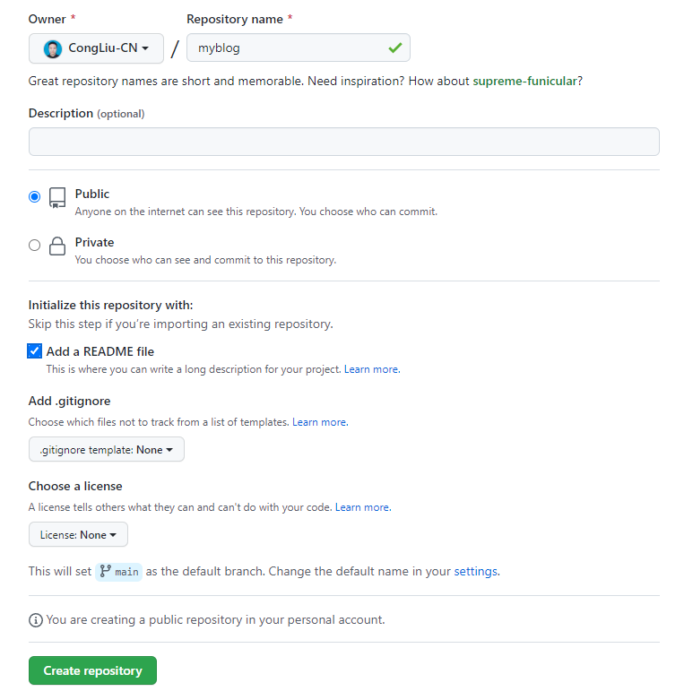

Building and maintaining a personal blog has always appealed to me. Since childhood, I’ve tried different ways of keeping my ideas: writing dairy, posting on social media, and uploading them to WordPress through FTP. But none of them worked.

After working as a software developer for half a year, I feel it is a perfect time for me to try something new since my programming skills have improved dramatically, meaning that I am able to solve most problems while building a new blog.

With that in mind, I have been following [Yihui’s blog](https://yihui.org/) for quite a while and liked it. So, I decided to build something similar using the framework called **BlogDown**, which is also the foundation of his blog.

Browsing through his blog, I found some useful resources that explain how to duplicate a blog quickly.

- [BlogDown Documentation](https://bookdown.org/yihui/blogdown/)

- [An Instruction about BlogDown written by one of its core developers](https://www.apreshill.com/blog/2020-12-new-year-new-blogdown/)

To get a full understanding of how to build a website using BlogDown, I highly recommend you go through the above essays. The purpose of this essay is just to give you a quick idea about each step.

## Pre-requisites

In Alison's post, she mentioned you need to know the basics about three things:

- R,
- the RStudio IDE, and
- GitHub.

For me, I've learned R and RStudio while studying Big Data Solution Architecture. Besides, I suppose most developers should know the basic about GitHub. Therefore, I am good to go with BlogDown.

## Step 0: Set your intentions


To me, it seems unnecessary to think the reason of doing something. I am always a fun of learning by doing. But Alison made her point. It would help me in the long run if I am serious about this blog. So I took a while to figure that out.

### 1. Content & Theme

The content you are about to put on your blog determines the theme you choose. For example, if you want to write academic staff, you probably want to adopt the [Academic theme](https://academic-demo.netlify.app/) and add your resume there.

However, my intention was just writing down my ideas from time to time, and put them into different categories. So, I adopted the [LoveIt theme](https://github.com/dillonzq/LoveIt), which is super clean and simple that also supports both English and Chinese.

### 2. Topic

Because my ideas vary in many fields, it is also important to focus on a few topics. After careful consideration, I decided the five pillars of my blog (also my life :joy:) as **Code, Body, Money, Food, Book**. One advantage of using this theme is that it supports as many categories as you want. So I can also add a sixth topic just by adding two lines in the corresponding post file.

For example, in the markdown file of this post:
```markdown
categories:
- code
```

### 3. Homepage

For some, homepage should be cool and without much conent other than a simple self-introduction. For me, I just liked the default one with LoveIt them, so I won't make any changes.

## Step 1: Create repo


She recommended using [**Netlify**](https://www.netlify.com) to both build and host your site. In this case, you can name the repository anything you want! I totally agree! Before that, we need setup our GitHub.

1. Go to [GitHub](https://github.com) and create a new repository.



2. Go to the main page of your new repository, and under the repository name, click the green **Clone or download** button.

3. Choose either SSH or HTTPS (if you don't know which, choose HTTPS). Choose by clicking on the clipboard icon to copy the remote URL for your new repository. You'll paste this text into RStudio in the next section.

## Step 2: Create project


We just created the remote repository on GitHub. To make a local copy on our computer that we can actually work in, we'll clone that repository into a new RStudio project. This will allow us to sync between the two locations: your remote (the one you see on github.com) and your local desktop.

Open up RStudio to create a new project where your website's files will live.
    
1. Click `File > New Project > Version Control > Git`.

1. Paste the copied URL from the previous step.

1. Be intentional about where you tell RStudio to create this new Project on your workstation.

## Step 3: Create site


1. The latest version of blogdown will not be available on CRAN until January 2021, but you can install the development version from GitHub with:

```
> if (!requireNamespace("remotes")) install.packages("remotes")
> remotes::install_github("rstudio/blogdown")
Using github PAT from envvar GITHUB_PAT
Downloading GitHub repo rstudio/blogdown@master
```

1. Let's use our first blogdown function to create a website with the Hugo Wowchemy "starter-academic" project:

```
> library(blogdown)
> new_site(theme = "wowchemy/starter-academic")
```

1. You should now see something like this. Take a moment to read through these messages - importantly, it tells you how to start and stop the server so you can preview your site. Importantly, when you come back to your project, note that you can use `blogdown::serve_site()` or the "Serve Site" addin to preview it locally. 

Let's select `y` to let blogdown start a server for us.
    
Exciting, isn't it? Now, don't trap your site in the RStudio Viewer pane. Let it out! Click to "Show in new window" (to the right of the :broom: icon) to preview it in a normal browser window. When you do that, you'll be re-directed to the site's main homepage. Let's find our way back to the R Markdown post. Click on `Posts > Hello R Markdown` to read it:

This is what blogdown gives you- everything else in the site is given to you by Hugo and your Wowchemy Hugo theme. But this post, and your ability to see output and plots rendered with <i class="fab fa-r-project"></i> is what blogdown adds!

1. Click **Create Project**.