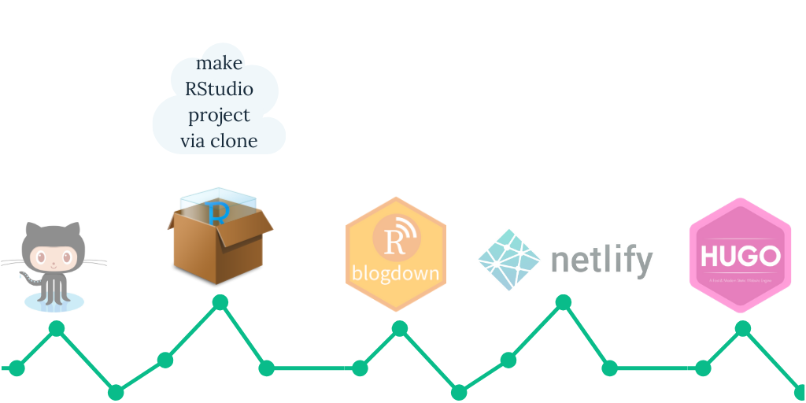
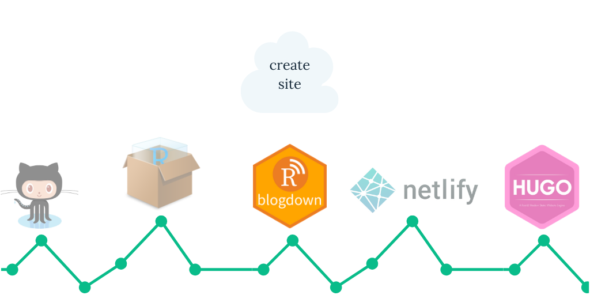
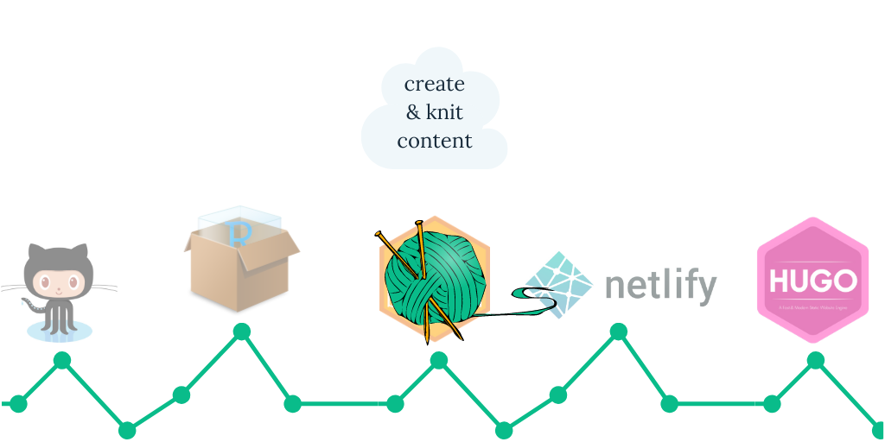
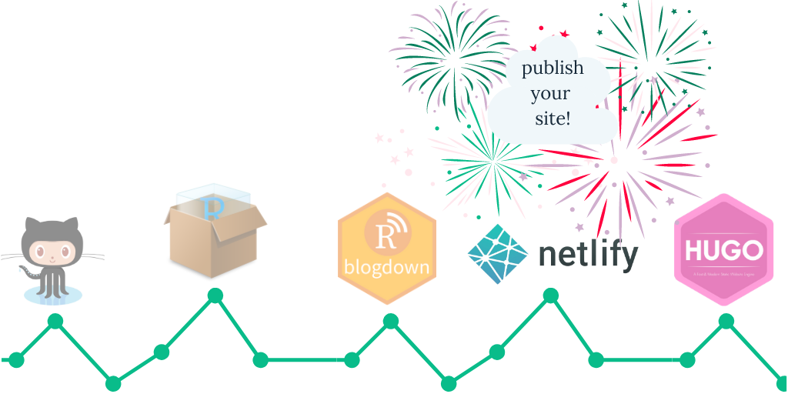
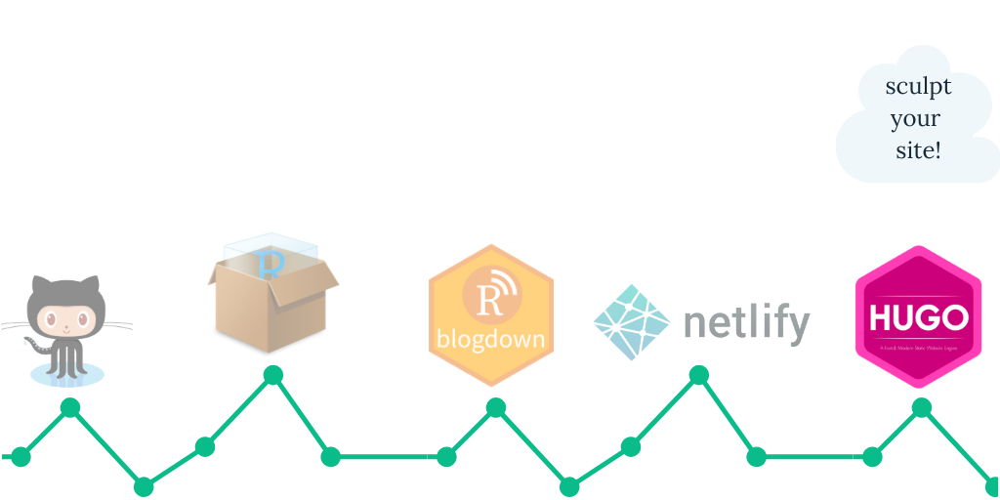

很久之前，我就有写博客的想法。苦于编程能力有限，难寻合适的框架。从小学时期的手写日记，到大学时期的WordPress加FTP，全都以失败告终。

在加拿大工作半年以后，我如今觉得自己的代码能力略有精进。应该能够驾驭一款简单的框架（即使不能，也可用搜索引擎解决）。

一方面是这种想法愈演愈烈，另一方面仰慕 [谢益辉的博客](https://yihui.org/) 已久。研究了他使用的是**BlogDown**框架。钻研了一番，发现了两个相关的网站：

- [BlogDown 官方文档](https://bookdown.org/yihui/blogdown/)

- [BlogDown创始人之一的博客](https://www.apreshill.com/blog/2020-12-new-year-new-blogdown/)

如果你自学能力较强的话，这两个网站应该能解决你博客搭建的大部分问题。

## 前期准备

在创始人的博客里，我发现了想要掌握 BlogDown 的前提是你要对以下三个东西都基本了解:

- R语言
- RStudio IDE
- GitHub

至于我本人，由于在大数据项目中略有涉猎 R 和 RStudio，同时也是因为 Github 是程序员的好朋友。所以我完全符合这三个前提，可以直接上手了。

## 行动之前: 制定大方向


我做事是属于三分钟热血型的，让我提前规划好一切是很难的一件事。我更偏爱在实践中学习。但是创始人的博客也给我了一丝启发，提前做做规划应该没什么坏处。

### 1. 选取主题

考虑一下你想写的东西是属于哪些门类吧！假如你是个学者或科研工作者，你很可能需要[学术风主题](https://academic-demo.netlify.app/)，顺便可以把简历加上去。但我可能思维天马行空，缺的是一种简介且有序的主题。多方比较后，我发现了这款主题很适合我————[LoveIt theme](https://github.com/dillonzq/LoveIt)。我也看中了它便捷的标签分类和支持切换中英文的功能。

### 2. 确定分类

虽然我的每天都有无数个新点子，但是我还是觉得有必要专注在一些特定的分类上面。目前，我觉得五个主题是个合适的数目，它们分别是**代码、健身、财富、饮食、阅读**。 这个框架还有个优点就是可以无限制添加新的分类，即使以后我想到了第六个分类，加上来也很方便。

比如，这篇文章的分类就是由以下代码实现的：
```markdown
categories:
- code
```

### 3. 主页

我也见过不少人的博客，有些人喜欢简洁风的主页，可能主页上只有一个他的头像和一句话。但我觉得那样太单调了，最好是让访客直接看见博客的内容。LoveIt 默认的主页很合我意，所以我也就懒得改了。

## 第一步: 创建Github仓库


其实用[**Netlify**](https://www.netlify.com)挺方便的，它帮忙自动化部署，而且允许你随便给仓库起名字，因为后续你可以自定义域名。但你如果非要用Github Pages起名字就要小心了，因为之后生成的域名是和名字匹配的。当然，这里说的名字是Netlify和Github帮你生成的免费域名，如果你后面自己买了域名，那就无所谓了。不过Netlify的自动部署却是Github不具备的亮点。

1. 打开[GitHub](https://github.com)并创建新的仓库。


2. 打开仓库的详情页面，找到并点击 **Clone or download** 按钮。

3. 选择 SSH or HTTPS， 如果你不知道啥是SSH的话就选HTTPS。这里面复制的链接记得保存好，下面要用到。

## 第二步: 创建项目



这一步是为了在本地创建一个位置，用来同步本地和远程的仓库。你在本地写的博客，改的其他任何文件，都可以一键同步到Github对应的仓库。所以这一步需要你在RStudio里面创建一个项目，再把Github上刚创建的仓库下载到RStudio这个项目里面。

打开 RStudio 并创建一个新项目。
    
1. 点击 `File > New Project > Version Control > Git`.

2. 把上一步保存的链接粘贴过来。

3. 记住或者保存好你 RStudio 项目的位置。

## 第三步: 创建网站



1. 安装最新版本的blogdown:

```
> if (!requireNamespace("remotes")) install.packages("remotes")
> remotes::install_github("rstudio/blogdown")
Using github PAT from envvar GITHUB_PAT
Downloading GitHub repo rstudio/blogdown@master
```

2. 调用 BlogDown，并设置主题。这里我们选取"starter-academic"，你也可以选其他的主题。引号里面的变量就是主题对应 Github 仓库的后缀:

```
> library(blogdown)
> new_site(theme = "wowchemy/starter-academic")
```

3. 接下来你会在输出里面看见一堆红字，不用担心，不看也没关系。只需记得你可以试着用`blogdown::serve_site()`来本地预览网站。RStudio 里面预览网页的窗口，扫把图标的右侧，可以让你在浏览器里预览。

## 第四步: 生产内容



你可以写原始的 `Markdown` 文件；也可以写 `.Rmarkdown`，再用 RStudio 内置的格式转换功能，将其转换为  `Markdown` n。比如，你可以这样创建：


```
> blogdown::new_post(title = "Hi Hugo", 
                     ext = '.Rmarkdown', 
                     subdir = "post")
```

## 第五步: 发布网站



我们发布网站用的是 Netlify。为啥现在很多人的博客都用它呢？因为免费而自动部署。自动部署的意思就是你上传代码到 Github 之后，它会监听到，同时重新创建你的网站。是不是很方便？

- 打开 Netlify.

- 注册，用你的 Github 账号注册就行，它就自动绑定了。要不然你自己注册新的账号非常麻烦，不推荐。

- 登录，选择: New site from Git > Continuous Deployment: GitHub。

- 选择你博客对应的仓库，并授权给 Netlify。

## 第六步: 自定义设置



其实第五步，你的网站就已经完成了。这边稍微说一下自定义CSS和修改网站基本配置。

### 修改网站基本配置

所有设置选项都在根目录下的 `config.yaml` 里面，需要你自己研究。我当初是反复尝试配合着本地预览。

### 自定义CSS

在这个位置 `assets/scss/custom.scss` 写入你自己的 SCSS 文件。如果你不太擅长，可以参考一个[很好的例子](https://github.com/rbind/apreshill/blob/main/assets/custom.scss)。

## 致谢

至此，你的博客就大功告成了！ :smile:

感谢您耐心的阅读，有什么问题可以在下方评论区留言。